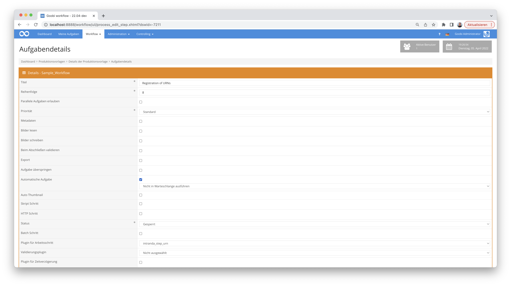

## Introduction
This documentation describes the installation, configuration and use of the Step Plugin for the generation of Uniform Resource Names in Goobi workflow.

## Installation
The plugin consists of the following file:

```bash
plugin-intranda-step-urn-base.jar
```

This file must be installed in the correct directory so that it is available at the following path after installation:

```bash
/opt/digiverso/goobi/plugins/step/plugin-intranda-step-urn-base.jar
```

In addition, there is a configuration file that must be located in the following place:

```bash
/opt/digiverso/goobi/config/plugin_intranda_step_urn.xml
```


## Overview and functionality
The plugin is usually executed fully automatically within the workflow. It first determines whether a Uniform Resource Name (URN) already exists. If no URN exists yet, a new URN is registered. If a URN already exists in the metadata, an attempt is made to update the metadata of the URN.

This plugin is integrated into the workflow in such a way that it is executed automatically. Manual interaction with the plugin is not necessary. For use within a workflow step, it should be configured as shown in the screenshot below.




## Note
This plugin uses a slightly modified table structure than the old URN plugin. When updating, it must be ensured that the urn column exists in the corresponding table. Furthermore, it must be ensured that e.g. for anchor elements whose URN was generated before the update, there is also a URN in the database.


## Configuration
The configuration of the plugin is done via the configuration file `plugin_intranda_step_urn.xml` and can be adjusted during operation. The following is an example configuration file:

{{CONFIG_CONTENT}}


| Parameter | Explanation |
| :--- | :--- |
| `project` | This parameter determines for which project the current block `<config>` should apply. The name of the project is used here. This parameter can occur several times per `<config>` block. |
| `step` | This parameter controls for which workflow steps the block `<config>` should apply. The name of the workflow step is used here. This parameter can occur several times per `<config>` block. |
| `apiUser` | The name of the API user. |
| `apiPassword` | The name of the API user. |
| `apiUri` | The URL of the API must be stored in this parameter. As a rule, the standard entry `https://api.nbn-resolving.org/v2/` can be used.  |
| `namespace` | The namespace in which the new URNs are created. |
| `infix` | Infix to be inserted in the generated URNs after the namespace. A new URN would have the form `{namespace}{infix}{generatedValue}`. |
| `generationMethod` | The plugin currently offers 2 options for generating a URN. `timestamp` and `increment`. The default value is `increment`. If you use `timestamp`, the time of generation of the URN will be appended after the infix in the form `2022-12-23-12-00-35`. If you choose increment, a counter (1,2, ...301,302,..) is used. |
| `checksum` | Here you can specify whether a check digit should be generated (`true`) or not (`false`). |
| `url`   | The URL under which the digitised work will be available in the future. As a rule, the publication URL will follow a pattern, e.g. `https://viewer.example.org/viewer/resolver?urn={pi.urn}`. The placeholder {pi.urn} will be replaced by the plugin with the new URN. |
| `work` | Switch that activates the setting of work URNs (Monograph, Manuscript, Volume, etc.). |
| `anchor` | Switch that activates the setting of URNs for the anchor element. |
| `allowed -> type` | Here you can list elements for which a URN is to be generated. For each element, a `<type>ElementName</type>` entry must be created in the `<allowed>` element. <br/>**Note:** If you set anchor or work to true, the anchor element and the work element will receive a URN even if their type names are not listed. |
| `typeNameMets` | Specifies the metadata type under which METS-URNs are to be recorded. The default should not be changed here. |
| `typeNameMods`  | Specifies the metadata type under which MODS-URNs are to be recorded. The default should not be changed here.  |
| `createModsUrns`  | If you want to write URNs in the MODS block, set this switch to `true`. However, bear in mind that it may be necessary to adjust the rule sets of individual structural elements.  |
